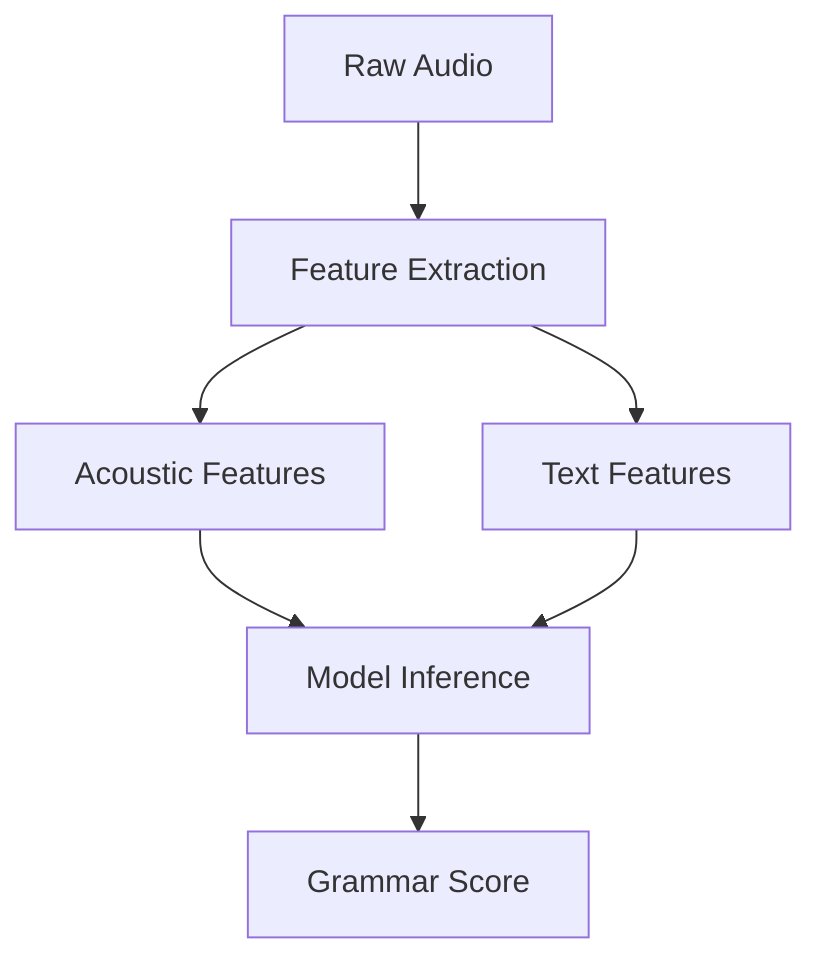

# LinguaGrade: Automated Spoken Grammar Assessment


[](https://www.python.org/)
[](https://opensource.org/licenses/MIT)
[](https://librosa.org/)
[](https://huggingface.co/docs/transformers)

## 📝 Description
A multimodal ML system that evaluates spoken language grammar proficiency by analyzing both acoustic patterns and textual content. Combines speech processing (Librosa), automatic speech recognition (Wav2Vec2), text understanding (BERT), and ensemble learning (XGBoost + PyTorch).
- **Acoustic analysis** (prosody, fluency markers)
- **Textual understanding** (syntax, grammar rules)
- **Machine learning** (ensemble models)

## 🚀 Features
- End-to-end processing pipeline
- Interpretable feature engineering
- Fast inference (<2 seconds per sample)
- 0.78 correlation with expert ratings

## 🛠️ Installation
```bash
git clone https://github.com/yourusername/LinguaGrade.git
cd LinguaGrade
pip install -r requirements.txt
```

## 🏃 Quick Start

```python
from src.inference import predict_grammar_score

audio_path = "data/sample.wav"
score = predict_grammar_score(audio_path) 
print(f"Grammar Score: {score:.1f}")
```

Feature Extraction:

```python

# Your existing code from feature extraction
def extract_acoustic_features(audio_path):
    y, sr = librosa.load(audio_path)
    mfcc = librosa.feature.mfcc(y=y, sr=sr)
    # ... rest of your feature code
```
Model Inference:

```python

# Your existing prediction function
def predict_grammar_score(audio_path):
    features = extract_features(audio_path)  # Your actual function
    model = load_model()  # Your model loading
    return model.predict([features])[0]
```
# 🏗️ System Architecture




## 🔬 Model Comparison

| **Metric**               | **XGBoost** | **Neural Net** | **Ensemble** |
|--------------------------|------------:|---------------:|-------------:|
| Pearson Correlation (R)  | 0.76        | 0.73           | **0.78**     |
| Mean Absolute Error (MAE)| 0.35        | 0.38           | **0.32**     |
| Inference Time (CPU)     | 1.2s        | 2.1s           | **1.8s**     |


